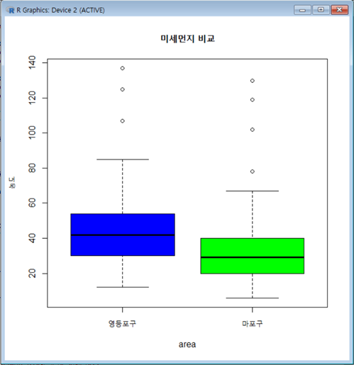

## 빅데이터 분석  (지역별 미세먼지 농도 분석 및 예측)

2019.04.22

R 3.5.2 

packages : psych 

library : xlsx , ggmap, ggplot2 , dplyr 


## 목차

### 1. 서론

#### 1) 과제개요


### 2. 본론

#### 1) 과제 수행 내용

* 과제1 : 분석을 위한 파일 만들기

* 과제2 : 구별로 측정기간의 미세먼지 평균 농도 표 만들기

* 과제3 : 지도에 구별로 미세먼지 평균 농도를 표기하기

* 과제4 : 2개 구의 미세먼지 차이를 통계적으로 분석하기

* 과제5 : 인공 신경망을 이용하여 2개 구의 미세먼지 예측


### 3. 결론

#### 1) 프로젝트 결과

####  [별첨] : 전체 코드

##   


### 1. 서론

* 과제 개요 : 지역별로 미세먼지 농도를 비교하고 예측해본다.
* 지도 API를 이용하여 지역별로 농도를 표기하고 미세먼지를 통계적으로 분석해본 후, 신경망을 이용해 미세먼지를 예측해본다.


### 2. 본론

#### [과제1] 분석을 위한 파일 만들기

- 서울 특별시 대기환경정보 웹사이트 접속`(http://cleanair.seoul.go.kr)`

  2017.09.01부터 17.12.31 사이의 대기 통계 검색


  

#### [과제2] **구별로 측정기간의 미세먼지 평균 농도 표 만들기** 

```
#dustdata.xlsx파일을 R에 업로드, 열의 개수 3173개 확인
dustdata <- read.xlsx(file.choose(),1,encoding="UTF-8")
str(dustdata)
'data.frame':	3173 obs. of  3 variables:
 $ yyyymmdd: Factor w/ 123 levels "2017-09-01","2017-09-02",..: 123 122 122 122 122 122 122 122 122 122 ...
 $ area    : Factor w/ 26 levels "강남구","강동구",..: 26 26 23 24 21 16 6 11 25 17 ...
 $ finedust: num  38 63 54 53 60 62 63 69 67 60 ...

```


- 데이터에 NA로 되어있을 겨우 해결법은? 

1. 그대로 결측치를 처리한다.  

2.  평균치 삽입 – 결측치가 아닌 데이터의  평균값을 삽입한다.  

3.  보삽법 – 과거 몇 년간의 평균값을  기입한다.  

4.  평가치 추정법 – 계산된 공식에 따라  추정한다. 

   -> 다양한 방법들을 고려해 봤을 때, Excel 파일에  각 날짜별로 일일 평균값들이 제공되어 있으므로 2번의 방법을 채택하여 일별 단위 평균값으로 NA값을 채움  


```
#25개 구의 이름을 연속하여 벡터에 저장
#unique()함수로 중복된 값 제고, 1번행의 ‘평균’ 텍스트 제거([2:26])
area_name <- unique(dustdata$area)
area_name <- as.vector(area_name)
area_name <- area_name[2:26]; area_name
 [1] "종로구"   "중구"     "용산구"   "성동구"   "광진구"   "동대문구" "중랑구"   "성북구"  
 [9] "강북구"   "도봉구"   "노원구"   "은평구"   "서대문구" "마포구"   "양천구"   "강서구"  
[17] "구로구"   "금천구"   "영등포구" "동작구"   "관악구"   "서초구"   "강남구"   "송파구"  
[25] "강동구"
```


```
# 전체 평균 농도를 저장하는 데이터프레임 만들기
dd_area <- data.frame(area="전체평균", avg_fd=dustdata$finedust[1])
dd_area
      area avg_fd
1 전체평균     38
```


```
#반복문을 통해 25개 구 별로 구 이름과 농도 평균 저장
dust_vector = c()
 
for(i in 1:25){
    mean_dust <- dustdata[dustdata$area == area_name[i],]
    dust_vector[i] <- mean(mean_dust[,3])
    
 }
dust_vector
 [1] 35.53279 35.90984 33.74590 41.48361 36.54918 41.26230 35.63934 42.74590 34.01639 37.55738
[11] 40.10656 35.58197 38.72131 32.97541 42.09836       NA 39.72951 35.41803 44.77869 40.54918
[21] 35.54098 41.86885 35.68033 37.46721 42.18033

# rbind에서 컬럼 이름 맞추고, dust_vetcor 소수점 3자리 반올림
# 전체평균이 저장된 dd_area와 구별 평균 데이터프레임 rbind
area <- area_name
avg_fd <- round(dust_vector, digit=3)
bind_data <- cbind(area, avg_fd)
dd_area <- rbind(dd_area, bind_data)
d_area
       area avg_fd
1  전체평균     38
2    종로구 35.533
3      중구  35.91
4    용산구 33.746
```

- 정합성을 판단하기 위해 직접 종로구의 미세먼지 농도 평균을 계산 


#### [과제3] : 지도에 구별로 미세먼지 평균농도를 표기하기

```
#1. paste()함수로 구 앞에 seoul을 붙여줌
seoul <- "서울특별시"
addr <- c()

#좌표를 받아오기 위해 paste로 구앞에 서울특별시를 붙임
for(i in 1:25) {
 	addr[i] <- paste(seoul,dd_area[i+1,1])
}
addr;
 [1] "서울특별시 종로구"   "서울특별시 중구"     "서울특별시 용산구"   "서울특별시 성동구"  
 [5] "서울특별시 광진구"   "서울특별시 동대문구" "서울특별시 중랑구"   "서울특별시 성북구"  
 [9] "서울특별시 강북구"   "서울특별시 도봉구"   "서울특별시 노원구"   "서울특별시 은평구"  
[13] "서울특별시 서대문구" "서울특별시 마포구"   "서울특별시 양천구"   "서울특별시 강서구"  
[17] "서울특별시 구로구"   "서울특별시 금천구"   "서울특별시 영등포구" "서울특별시 동작구"  
[21] "서울특별시 관악구"   "서울특별시 서초구"   "서울특별시 강남구"   "서울특별시 송파구"  
[25] "서울특별시 강동구"
```


```
#2. 지도의 중심좌표를 서울로 놓고 1행에 삽입
gc <- geocode('seoul',source="google")
cen <- as.numeric(gc)
cen
[1] 126.97797  37.56654
```


```
#3. 각 구의 좌표를 받아 1행(중심좌표) 뒤에 연결
gc2 <- geocode(enc2utf8(addr), source ="google")
gc <- rbind(gc,gc2)
```


```
#4. 서울 맵 가져오기
map <- get_googlemap(center=cen, maptype="roadmap", zoom=11)
```


```
#5. 미세먼지 농도 평균값과 좌표 데이터 cbind 
#각 구별 마커와 데이터를 지도에 함께 출력
code_area_final <- cbind(dd_area, gc$lon,gc$lat)
colnames(code_area_final) <- c("area","avg_fd","lon","lat")

ggmap(map, extent="device") + geom_point(data=code_area_final,aes(x=lon, y=lat),color="red", size=3) + geom_text(data=code_area_final, aes(label=avg_fd,vjust=-1))
```


- 구 별 평균미세먼지 농도


- 지도에서 누락되는 지역에 대해서는 어떻게 해결할 것인가?

  ㅡ 25개 구의 좌표를 올바르게 받아왔는데 지도에 출력이 되지 않는 이유는 기반이 되는 지도의 크기가 맞지 않기 때문이다. 따라서 다음 구문에서 

  map <- get_googlemap(center=cen, maptype="roadmap", zoom=12)

  zoom의 값을 11로 지정하면 map의 크키가 줄어들면서 25개의 구를 모두 표시할 수 있다.


#### [과제 4] 2개 구의 미세먼지 차이를 통계적으로 분석하기

```
# dplyr 라이브러리를 사용해 데이터 처리 간편화
# 구별 평균 농도 값에 대해 최대값과 최소값을 갖는 구 찾기
library(dplyr)
max<-max(dd_area$avg_fd)
min<-min(dd_area$avg_fd)
filter(dd_area,dd_area$avg_fd==max) #미세먼지농도가 최악인 구
	area avg_fd
1   영등포구 44.779
filter(dd_area,dd_area$avg_fd==min) #미세먼지농도가 최선인 구
	area avg_fd
1   마포구 32.975
```

ㅡ> 최악과 최선인 구가 각각 영등포구, 마포구임을 알 수 있음


```
# 미세분석을 위해 2개의 구 데이터만 발췌 및 NA 값이 없는지 확인
dustdata_anal<-filter(dustdata,dustdata$area=="영등포구"|dustdata$area=="마포구");
dustdata_anal
      yyyymmdd     area finedust
1   2017-12-31   마포구       63
2   2017-12-31 영등포구       70
3   2017-12-30   마포구      130
4   2017-12-30 영등포구      137
5   2017-12-29   마포구      102
6   2017-12-29 영등포구      107
7   2017-12-28   마포구       45
….
```


- 엑셀데이터의 필터링 후 결과 


ㅡ> 위와 데이터 개수, 값이 동일 


```
# 영등포구와 마포구를 분리하여 데이터프레임에 저장 
dda_area_yp <-filter(dustdata_anal,dustdata_anal$area=="영등포구"); dda_area_yp 
yyyymmdd     area finedust
1   2017-12-31 영등포구       70
2   2017-12-30 영등포구      137
3   2017-12-29 영등포구      107
4   2017-12-28 영등포구       50
…
dda_area_mp <-filter(dustdata_anal,dustdata_anal$area=="마포구"); dda_area_mp
yyyymmdd   area finedust
1   2017-12-31 마포구       63
2   2017-12-30 마포구      130
3   2017-12-29 마포구      102
4   2017-12-28 마포구       45
…
```


````
# 기초 통계량 분석 및 비교
# 왜도와 첨도를 구해주는 psych 라이브러리 사용
library(psych)
describe(dda_area_yp$finedust)
   vars   n  mean   sd median trimmed   mad min max range skew kurtosis   se
X1    1 122 44.78 20.6     42   42.54 17.79  12 137   125 1.51      3.9 1.87
describe(dda_area_mp$finedust)
   vars   n  mean    sd median trimmed   mad min max range skew kurtosis   se
X1    1 122 32.98 19.69     29   30.42 14.83   6 130   124 2.12     6.86 1.78
````

ㅡ> 개수, 평균, 표준편차, 중앙값, 절사 평균 등의 데이터 요약 제시


```
# boxplot 그래프 
boxplot(dda_area_yp$finedust, dda_area_mp$finedust,col=c("blue","green"),
main="미세먼지 비교",
xlab="area",
ylab="농도",
names=c("영등포구","마포구"))
```

- 영등포구, 마포구의 미세먼지 비교 box plot




```
# t검정을 통한 통계적 검정
t.test(data=dustdata_anal,finedust~area,var.equal=T)

	Two Sample t-test

data:  finedust by area
t = -4.5743, df = 242, p-value = 7.635e-06
alternative hypothesis: true difference in means is not equal to 0
95 percent confidence interval:
 -16.886130  -6.720427
sample estimates:
  mean in group 마포구 mean in group 영등포구 
              32.97541               44.77869 
```

- t 검정을 통한 통계적 분석(해석)

귀무가설 H0 : “2개 구의 미세먼지는 차이가 없다.”

대립가설 H1 : “2개 구의 미세먼지는 차이가 있다.”

t-검정을 통해 95%의 신뢰수준 내에서 p-value값이 7.635e-06 = 0.000007635 이므로 유의 수준 값인 0.05보다 작다.

따라서, 귀무가설을 기각, 대립가설을 채택한다.

∴  95%의 신뢰구간 내에서 2개 구의 미세먼지는 차이가 있다.


#### [과제5] 인공 신경망을 이용하여 2개 구의 미세먼지 예측

```
# 데이터 전처리과정 
# 날짜를 오름차순으로 정렬
#영등포구 데이터
df1 <- data.frame(일자=dda_area_yp$yyyymmdd, 농도=dda_area_yp$finedust);
df1<- df1[seq(dim(df1)[1],1),]
head(df1)
          일자 농도
122 2017-09-01   31
121 2017-09-02   36
120 2017-09-03   40
119 2017-09-04   30
118 2017-09-05   30
117 2017-09-06   34

#마포구 데이터
df2 <- data.frame(일자=dda_area_mp$yyyymmdd, 농도=dda_area_mp$finedust);
df2 <- df2[seq(dim(df2)[1],1),]
head(df2)
          일자 농도
122 2017-09-01   20
121 2017-09-02   23
120 2017-09-03   29
119 2017-09-04   27
118 2017-09-05   21
117 2017-09-06   24
```


```
#2개 구 원시 데이터의 산점도
plot(df1$일자, df1$농도, xlab="일자", ylab="농도", type="o",family="AppleMyungjo")
plot(df2$일자, df2$농도, xlab="일자", ylab="농도", type="o",family="AppleMyungjo")
```


인공 신경망을 학습하기 위해 모델을 아래의 표와 같이 정한다.

| 인공신경망 모델 선정 |       |       |       |
| -------------------- | ----- | ----- | ----- |
|                      | 모델1 | 모델2 | 모델3 |
| INPUT_NODES          | 10    | 10    | 10    |
| HIDDEN_NODES         | 2     | 1     | 4     |
| OUTPUT_NODES         | 5     | 5     | 5     |
| ITERATION            | 500   | 1000  | 500   |

```
#2개의 구 별 최적의 모델을 찾기 위해 실제값과 에러의 차이를 통한 MAPE value 계산
# 학습 입력 데이터 만들기
in_learning <- getDataSet(df1$농도, 1, 112, INPUT_NODES);
# 학습 목표치 데이터 만들기
out_learning <- getDataSet(df1$농도, 11, 117, OUTPUT_NODES);
# 학습
model1_1 <- nnet(in_learning, out_learning, size=HIDDEN_NODES, linout=TRUE, skip=TRUE, rang=0.1, maxit=ITERATION)
# 예측 입력 데이터 만들기
in_forecasting <- getDataSet(df1$농도, 108, 117, INPUT_NODES);
# 예측
predicted_values <- predict(model1_1, in_forecasting, type="raw");
# 실제 값 데이터 만들기
real <- getDataSet(df$농도, 118, 122, OUTPUT_NODES);
# 에러 계산 및 출력
ERR <- abs(real - predicted_values)
MAPE <- mean(ERR / real) * 100;    MAPE
```

| 영등포구 MAPE value |              |              |              |              |          |
| ------------------- | ------------ | ------------ | ------------ | ------------ | -------- |
|                     | 1            | 2            | 3            | 4            | 5        |
| 모델1               | 57.38327     | 51.86781     | 49.17133     | **40.03608** | 57.76949 |
| 모델2               | 53.57766     | **46.68459** | 47.72087     | 51.55312     | 47.35033 |
| 모델3               | 60.41088     | 44.99609     | **34.85378** | 68.17315     | 69.18446 |
| 마포구 MAPE value   |              |              |              |              |          |
|                     | 1            | 2            | 3            | 4            | 5        |
| 모델1               | **39.61152** | 40.50894     | 47.88143     | 52.74825     | 54.71388 |
| 모델2               | 50.04539     | 58.948       | 44.5589      | **42.89807** | 45.27881 |
| 모델3               | 86.36694     | **37.32027** | 40.80906     | 67.63539     | 52.60391 |

-> 각각의 모델별로 5회씩 계산한 결과 영등포구에서는 모델3-3, 마포구에서는 모델3-2가 MAPE value가 가장 낮아 최적의 모델로 선정

 

```
#각 구별 예측 결과
#영등포 예측 결과
in_learning <- getDataSet(df1$농도, 1, 117, INPUT_NODES); 
# 학습 목표치 데이터 만들기
out_learning <- getDataSet(df1$농도, 11, 122, OUTPUT_NODES);
in_forecasting <- getDataSet(df1$농도, 113, 122, INPUT_NODES);
predicted_values <- predict(model1_3_2, in_forecasting, type="raw");    
plot(1:10, df1$농도[113:122], xlab="일자", ylab="농도", xlim=c(0, 15), ylim=c(20, 140), type="o")
lines(11:15, predicted_values, type="o", col="red")
predicted_values
         [,1]     [,2]     [,3]     [,4]    [,5]
[1,] 48.24394 48.13275 46.28539 49.44476 42.1531


#마포구 예측 결과
in_learning <- getDataSet(df2$농도, 1, 117, INPUT_NODES); 
# 학습 목표치 데이터 만들기
out_learning <- getDataSet(df2$농도, 11, 122, OUTPUT_NODES);
in_forecasting <- getDataSet(df2$농도, 113, 122, INPUT_NODES);
predicted_values <- predict(model3_2, in_forecasting, type="raw");    
plot(1:10, df$농도[113:122], xlab="일자", ylab="농도", xlim=c(0, 15), ylim=c(20, 140), type="o")
lines(11:15, predicted_values, type="o", col="red")
predicted_values
         [,1]     [,2]     [,3]     [,4]     [,5]
[1,] 25.59356 36.01613 41.15934 27.57094 48.51702
```


Blue = 실제 관측값, Red = 인공신경망 예측 값

##### 영등포구 2018년 1월 1일 ~ 2018년 1월 5일 (5일) 예측 결과


##### 마포구 2018년 1월 1일 ~ 2018년 1월 5일 (5일) 예측 결과


인공신경망을 통해 두개 구의 5일 후를 예측한 결과는 5회씩의 모델 선별과정을 통해 선정된 모델임에도 실제 관측값과는 다소 차이가 있음을 알 수 있었다. 

그렇다면 인간의 판단에 의한 예측이 인공신경망에 의한 데이터보다 더 확실하다고 할 수 있을까? 

인간은 감에 의한 판단도 할 수 있지만 환경, 사회 등 실제 데이터에 내포되어 있는 외부 요소를 수용하고 이에 따라서 생각을 할 수 있기 때문에 어쩌면 인공신경망보다 더 정확한 예측을 할 수 있다. 하지만 수집한 데이터의 불확실성, 편파적 정보 수용 등 또 다른 외부적인 요인에 의해 예측 값이 정확하지 않을 수도 있다.

그에 반해 인공신경망은 감이 아닌 수학적 연산을 통해 선형관계를 예측하기 때문에 보다 중립적인 데이터를 예측할 수 있다는 장점이 있다. 하지만 보다 정밀한 예측을 위해서는 더 많은 gpu연산 등 전력자원의 소모가 크고, 시간 또한 오래 걸린다. 

인간의 판단과 인공신경망은 궁극적으로 공통된 큰 문제를 가지는데, 예측한 결과를 믿을 수 있는 지 없는 지에 대한 확신을 가질 수 없다.

 

이번 프로젝트에 사용된 인공신경망은 답을 알려주는 지도학습이기에 예측의 결과가 한정적이라는 한계를 가진다. 그러므로 학습 데이터의 개수를 증가시키고 신경망의 은닉층의 정밀화, 더 좋은 모델을 선정한다면 관측값과 어느정도는 유사한 값을 가질 수 있을 것이라고 생각한다. 또한 비지도 학습을 통해 최근 떠오르는 GAN(생산적 대립 신경망)을 통해 데이터의 확률분포를 학습하고 군집화(clustering)함으로써 지도학습보다 더 정확한 예측을 할 수 있다. 


### 3. 결론

#### [프로젝트 결과]

\- 서울 특별시의 미세먼지 농도 데이터를 스크랩해서 데이터로 저장시킬 수 있었다. 


\- 미세먼지 농도 데이터와 구글이 제공하는 map API를 활용해 서울 특별시의 각 구별 좌표를 다운로드하고 두 데이터를 합쳐 지도에 같이 표기할 수 있었다.

 

\- 미세먼지가 가장 높은 영등포구와 가장 낮은 마포구의 통계적 검정을 통해 2개 구의 미세먼지 농도는 차이가 없음을 유의수준 5%내에서 증명했다.

 

\- 인공 신경망을 구축해서 2개 구의 5일 후 데이터를 모델링을 거쳐 예측해 볼 수 있었다. 모델 별 각각 5회씩 계산하고 나온 가장 적합한 모델로 예측을 했음에도 실제 관측값과는 차이가 있음을 알 수 있었다. 여기서 예측의 결과가 한정적인 지도학습의 한계를 느낄 수 있었다. 


#### [별첨] : 전체코드

```
#과제 1
install.packages('xlsx')	
library(xlsx)
dustdata <- read.xlsx("C:\\Users\\LG\\Desktop\\dustdata.xlsx",1,encoding = "UTF-8")
```

```
#과제 2
area_name <- unique(dustdata$area)
area_name <- as.vector(area_name)
area_name <- area_name[2:26]; area_name

dd_area <- data.frame(area="전체평균", avg_fd=dustdata$finedust[1])
dd_area

dust_vector = c()

for(i in 1:25){
   mean_dust <- dustdata[dustdata$area == area_name[i],]
   dust_vector[i] <- mean(mean_dust[,3])
   
}
dust_vector

area <- area_name
avg_fd <- round(dust_vector, digit=3)

bind_data <- cbind(area, avg_fd)
bind_data

dd_area <- rbind(dd_area, bind_data)

dd_area
```

```
#과제 3
library(ggmap)
library(ggplot2)
register_google ("secret")
seoul <- "서울특별시"
addr <- c()

#좌표를 받아오기 위해 paste로 구앞에 서울특별시를 붙임
for(i in 1:25) {
	addr[i] <- paste(seoul,dd_area[i+1,1])
}
gc <- geocode('seoul',source="google")
cen <- as.numeric(gc)
cen   #126.97797  37.56654
#서울의 중심좌표를 1행에 넣음
code_area <- data.frame(lon=gc[1],lat=gc[2])

#각 구의 좌표 받아오고 rbind로 1행 뒤에 연결 시켜줌
gc2 <- geocode(enc2utf8(addr), source ="google")
#gc3 <- as.matrix(gc2)
gc <- rbind(gc,gc2)
#gc4 <- as.matrix(gc)

#서울 맵 받아오기
map <- get_googlemap(center=cen, maptype="roadmap", zoom=11)

#합치기
code_area_final <- cbind(dd_area, gc$lon,gc$lat)
colnames(code_area_final) <- c("area","avg_fd","lon","lat")

ggmap(map, extent="device") + geom_point(data=code_area_final,aes(x=lon, y=lat),color="red", size=3) + geom_text(data=code_area_final, aes(label=avg_fd,vjust=-1))

```

```
#과제 4
library(dplyr)
#1 
max<-max(dd_area$avg_fd)
min<-min(dd_area$avg_fd)
filter(dd_area,dd_area$avg_fd==max) #미세먼지농도가 최악인 구
filter(dd_area,dd_area$avg_fd==min) #미세먼지농도가 최선인 구

#2 #3 출력확인 및 검사
dustdata_anal<-filter(dustdata,dustdata$area=="영등포구"|dustdata$area=="마포구"); dustdata_anal

#4
dda_area_yp <-filter(dustdata_anal,dustdata_anal$area=="영등포구"); dda_area_yp 
dda_area_mp <-filter(dustdata_anal,dustdata_anal$area=="마포구"); dda_area_mp

#5 
install.packages('psych')
library(psych)
describe(dda_area_yp$finedust)
describe(dda_area_mp$finedust)

#6
boxplot(dda_area_yp$finedust, dda_area_mp$finedust,col=c("blue","green"),
main="미세먼지 비교",
xlab="area",
ylab="농도",
names=c("영등포구","마포구"))

#7
t.test(data=dustdata_anal,finedust~area,var.equal=T)
```

```
#과제 5
#df1 영등포, df2 마포

df1 <- data.frame(일자=dda_area_yp$yyyymmdd, 농도=dda_area_yp$finedust);
df1<- df1[seq(dim(df1)[1],1),]
head(df1)
          일자 농도
122 2017-09-01   31
121 2017-09-02   36
120 2017-09-03   40
119 2017-09-04   30
118 2017-09-05   30
117 2017-09-06   34

df2 <- data.frame(일자=dda_area_mp$yyyymmdd, 농도=dda_area_mp$finedust);
df2 <- df2[seq(dim(df2)[1],1),]
head(df2)
          일자 농도
122 2017-09-01   20
121 2017-09-02   23
120 2017-09-03   29
119 2017-09-04   27
118 2017-09-05   21
117 2017-09-06   24

plot(df1$일자, df1$농도, xlab="일자", ylab="농도", type="o",family="AppleMyungjo")
plot(df2$일자, df2$농도, xlab="일자", ylab="농도", type="o",family="AppleMyungjo")
#모델 1
INPUT_NODES   <- 10
HIDDEN_NODES  <- INPUT_NODES * 2
OUTPUT_NODES  <- 5              
ITERATION     <- 500

#모델 2
INPUT_NODES   <- 10
HIDDEN_NODES  <- INPUT_NODES * 1
OUTPUT_NODES  <- 5              
ITERATION     <- 1000
#모델 3
INPUT_NODES   <- 10
HIDDEN_NODES  <- INPUT_NODES * 4
OUTPUT_NODES  <- 5              
ITERATION     <- 500

# 학습 입력 데이터 만들기
in_learning <- getDataSet(df1$농도, 1, 112, INPUT_NODES);
# 학습 목표치 데이터 만들기
out_learning <- getDataSet(df1$농도, 11, 117, OUTPUT_NODES);
# 학습
model1_1 <- nnet(in_learning, out_learning, size=HIDDEN_NODES, linout=TRUE, skip=TRUE, rang=0.1, maxit=ITERATION)
# 예측 입력 데이터 만들기
in_forecasting <- getDataSet(df1$농도, 108, 117, INPUT_NODES);
# 예측
predicted_values <- predict(model1_1, in_forecasting, type="raw");
# 실제 값 데이터 만들기
real <- getDataSet(df$농도, 118, 122, OUTPUT_NODES);
# 에러 계산 및 출력
ERR <- abs(real - predicted_values)
MAPE <- mean(ERR / real) * 100;    MAPE

#영등포 예측 결과
in_learning <- getDataSet(df1$농도, 1, 112, INPUT_NODES); 
# 학습 목표치 데이터 만들기
out_learning <- getDataSet(df1$농도, 11, 122, OUTPUT_NODES);
in_forecasting <- getDataSet(df1$농도, 113, 122, INPUT_NODES);
predicted_values <- predict(model1_3_2, in_forecasting, type="raw");    
plot(1:10, df1$농도[113:122], xlab="일자", ylab="농도", xlim=c(0, 15), ylim=c(20, 140), type="o")
lines(11:15, predicted_values, type="o", col="red")
predicted_values
         [,1]     [,2]     [,3]     [,4]    [,5]
[1,] 48.24394 48.13275 46.28539 49.44476 42.1531


#마포구 예측 결과
in_learning <- getDataSet(df2$농도, 1, 117, INPUT_NODES); 
# 학습 목표치 데이터 만들기
out_learning <- getDataSet(df2$농도, 11, 122, OUTPUT_NODES);
in_forecasting <- getDataSet(df2$농도, 113, 122, INPUT_NODES);
predicted_values <- predict(model3_2, in_forecasting, type="raw");    
plot(1:10, df$농도[113:122], xlab="일자", ylab="농도", xlim=c(0, 15), ylim=c(20, 140), type="o")
lines(11:15, predicted_values, type="o", col="red")
predicted_values
         [,1]     [,2]     [,3]     [,4]     [,5]
[1,] 25.59356 36.01613 41.15934 27.57094 48.51702

```

